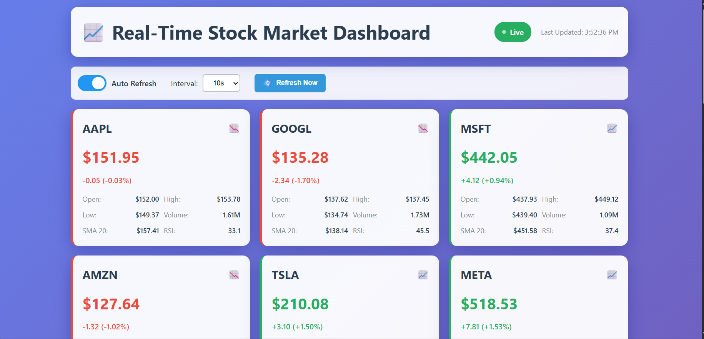
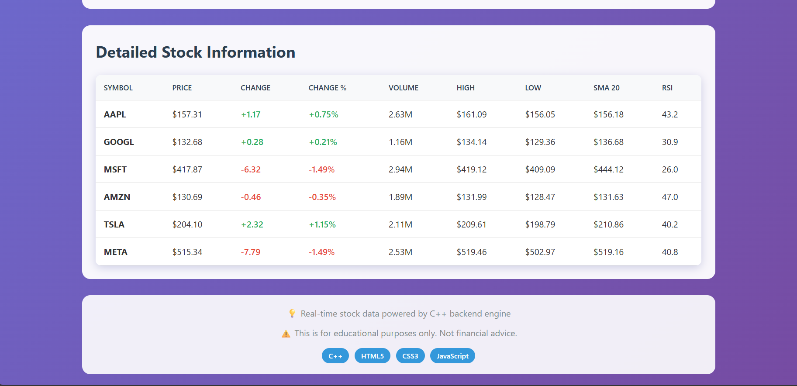

# Real-Time Stock Market Dashboard

A real-time stock market dashboard with a C++ backend server and HTML/CSS/JavaScript frontend. This project simulates live stock data for major tech companies and displays it in an interactive dashboard.

## Features

- Real-time stock price updates
- Technical indicators (SMA20, SMA50, RSI, Volatility)
- Interactive dashboard with auto-refresh
- Detailed stock information table
- Market summary statistics
- Performance comparison chart

## Supported Stocks

- AAPL (Apple)
- GOOGL (Google)
- MSFT (Microsoft)
- AMZN (Amazon)
- TSLA (Tesla)
- META (Meta)

## Prerequisites

- C++ compiler (MinGW-w64 recommended for Windows)
- Windows operating system
- Web browser

## Building and Running

1. Make sure you have MinGW-w64 installed and added to your PATH
2. Open a terminal in the project directory
3. Compile the server:

   ```bash
   g++ main.cpp -o stock_server -lws2_32
   ```

4. Run the server:

   ```bash
   .\stock_server
   ```

5. Open your web browser and navigate to:

   ```text
   http://localhost:5000
   ```

## Project Structure

- `main.cpp` - C++ backend server implementation
- `index.html` - Main dashboard HTML
- `style.css` - Dashboard styling
- `script.js` - Frontend JavaScript for real-time updates
- `README.md` - Project documentation

## Technical Details

### Backend (C++)

- Custom HTTP server implementation
- WebSocket support for real-time data
- Simulated stock data generation
- Technical indicator calculations
  - Simple Moving Averages (20 and 50 periods)
  - Relative Strength Index (RSI)
  - Volatility calculation

### Frontend

- Responsive design
- Auto-refresh functionality
- Interactive controls
- Real-time data updates
- Tabular and graphical data display

## Usage

1. Start the server using the instructions above
2. Access the dashboard in your web browser
3. Use the auto-refresh toggle to control updates
4. Adjust the refresh interval as needed
5. Click "Refresh Now" for immediate updates
6. View detailed information in the table below

## Notes

- This is a simulation for educational purposes
- Stock prices are generated using a random walk algorithm
- Technical indicators are calculated based on simulated price history
- Not intended for actual trading decisions

  ## output
  




## License

This project is for educational purposes only. The simulated data should not be used for actual trading decisions.


